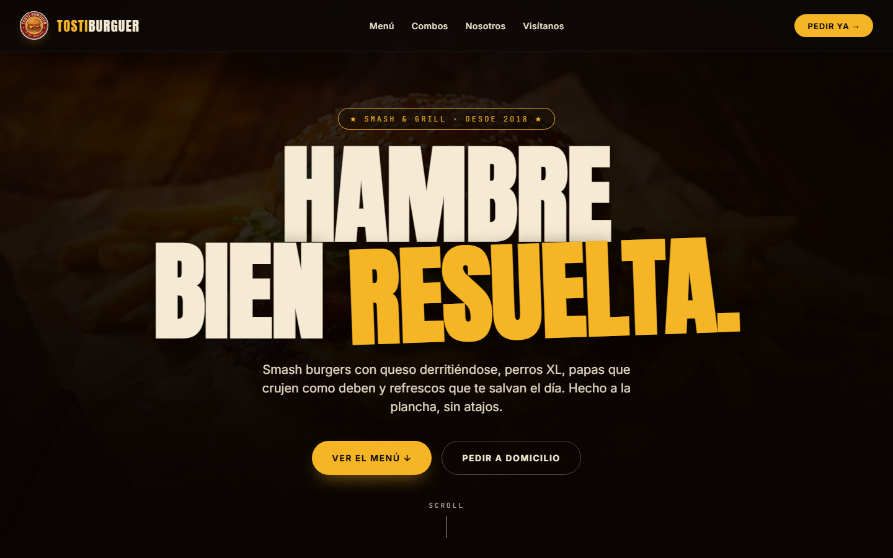
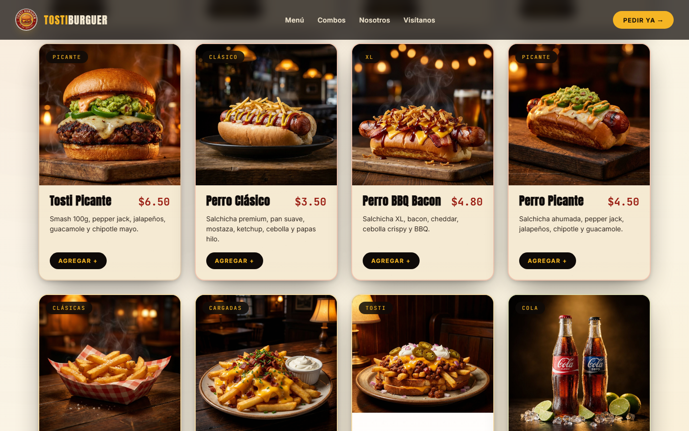
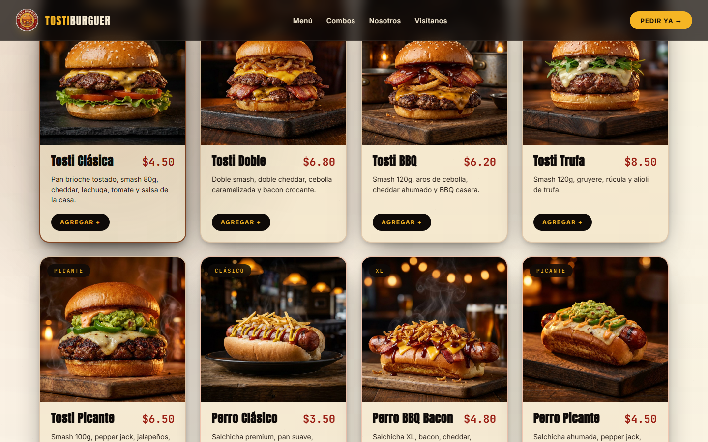
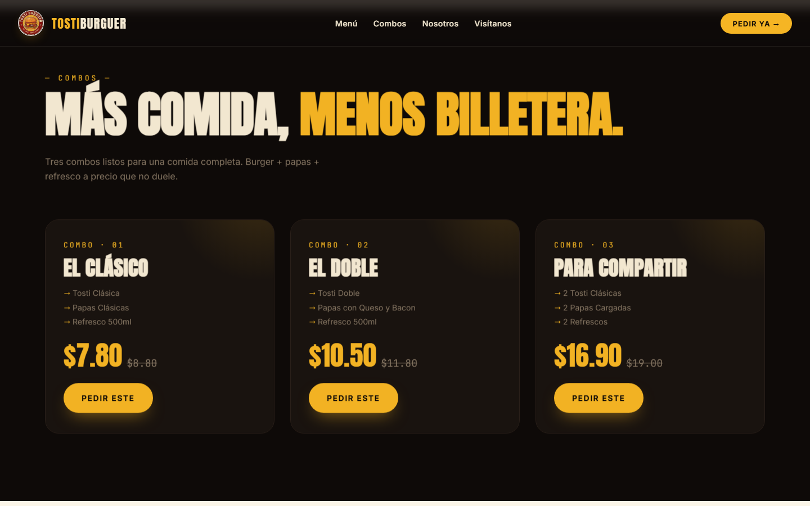
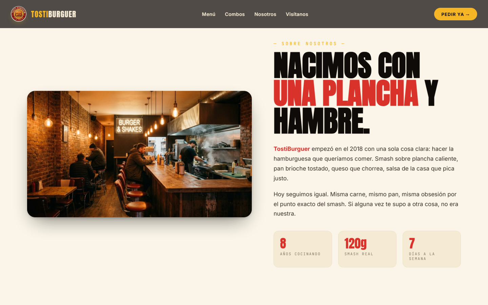
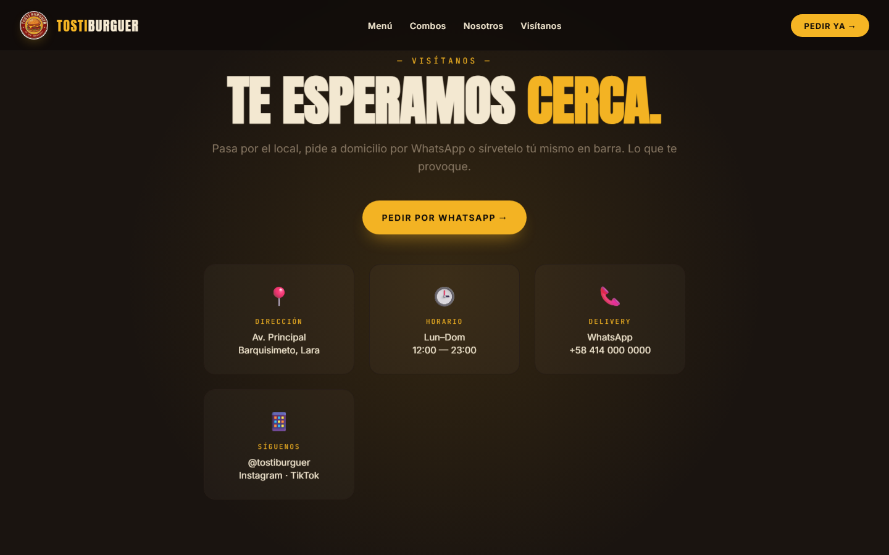
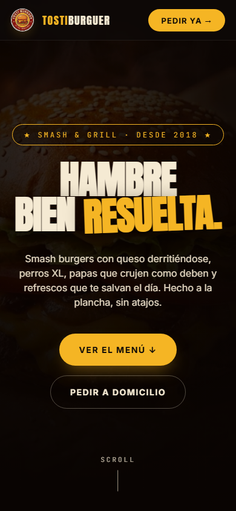

# 🍔 TostiBurguer — Landing Page

> Sitio web oficial de **TostiBurguer**, hamburguesería artesanal especializada en smash burgers, perros XL, papas crujientes y refrescos. Página de una sola vista (single-page) con menú interactivo y panel de combos.


---

## 📋 Tabla de Contenidos

- [Descripción](#-descripción)
- [Demo en vivo](#-demo-en-vivo)
- [Capturas de pantalla](#-capturas-de-pantalla)
- [Características](#-características)
- [Stack técnico](#-stack-técnico)
- [Estructura del proyecto](#-estructura-del-proyecto)
- [Desarrollo local](#-desarrollo-local)
- [Build & Deploy](#-build--deploy)
- [Personalización](#-personalización)
- [Roadmap](#-roadmap)
- [Contribuciones](#-contribuciones)
- [Licencia](#-licencia)
- [Autor](#-autor)

---

## 🧾 Descripción

**TostiBurguer** es el sitio web comercial de una hamburguesería con operación local y servicio a domicilio. El objetivo del proyecto es ofrecer una presencia digital rápida, visualmente atractiva y orientada a conversión, donde el cliente pueda:

- Conocer la propuesta gastronómica de un vistazo.
- Explorar el menú completo filtrando por categoría.
- Visualizar combos con descuentos ya aplicados.
- Ubicar el local y contactar vía WhatsApp en un solo clic.

El proyecto fue diseñado siguiendo una estética **diner retro americano con twist latinoamericano**: tipografía display bold (Anton), colores cálidos (mostaza, ketchup, crema, ink) y fotografía de producto en alta fidelidad. Sin frameworks de JavaScript y sin dependencias de runtime en el frontend: **HTML5 + CSS3 + Vanilla JS + HTML5 Canvas**.

---

## 🚀 Demo en vivo

🔗 **URL pública:** [https://agent-cdn.minimax.io/mcp/anon/general/1782086658_010feacb.html](https://agent-cdn.minimax.io/mcp/anon/general/1782086658_010feacb.html)

---

## 📸 Capturas de pantalla

### Hero


### Menú interactivo


### Card hover (efecto spotlight sobre `<canvas>`)


### Combos


### Sobre nosotros


### Visítanos / Delivery


### Vista móvil


---

## ✨ Características

| Feature | Descripción |
|---|---|
| **Single-page layout** | Una sola URL, navegación con scroll suave a secciones (`#menu`, `#combos`, `#about`, `#contact`). |
| **Hero cinematrográfico** | Imagen smash burger con `kenburns` (24s loop) + overlay oscuro con viñeta para legibilidad del headline. |
| **Menú filtrable** | 14 productos en 4 categorías (🍔 Burgers · 🌭 Perros · 🍟 Papas · 🥤 Refrescos) con filtro sticky. |
| **HTML5 Canvas overlay** | Spotlight radial con el color de cada categoría al hacer hover sobre las cards del menú. |
| **Combos** | 3 paquetes con precio tachado + precio final destacado. |
| **WhatsApp CTA** | Botón flotante con deep link a `wa.me` con mensaje pre-llenado. |
| **Responsive** | Mobile-first, breakpoints en `680px` y `880px`. Probado en 390×844 (iPhone 14). |
| **Accesibilidad básica** | `alt` en todas las imágenes, `loading="lazy"`, `onerror` fallback, contraste WCAG AA en textos. |
| **Performance** | Sin frameworks, CSS crítico inline, fuentes con `preconnect`, imágenes optimizadas (JPG q=85). |
| **Marquee animado** | Ticker infinito de claims ("HECHO A LA PLANCHA · SMASH BURGERS · QUESO REAL · DESDE 2018"). |
| **Reveal on scroll** | IntersectionObserver para fade+rise de cards y secciones. |
| **Smooth scroll** | Scroll suave compensado por la altura de la nav. |

---

## 🛠 Stack técnico

- **HTML5** — semántico (`<header>`, `<section>`, `<article>`, `<nav>`, `<footer>`).
- **CSS3** — Custom properties (`:root` tokens), Grid, Flexbox, animaciones (`@keyframes`), `backdrop-filter`, `mix-blend-mode`.
- **JavaScript (ES6+)** — Vanilla, sin dependencias. Usa `IntersectionObserver`, `requestAnimationFrame`, `Canvas 2D API`.
- **HTML5 Canvas API** — Para el spotlight del menú y el film grain sutil.
- **Google Fonts** — Anton (display), Inter (UI), JetBrains Mono (precios).
- **PowerShell** — Script de optimización de imágenes (PNG → JPG con `System.Drawing`).

**Peso total de la página:** ~3 MB (incluye 17 imágenes JPG optimizadas, sin fuentes externas lazy-loaded).

---

## 📁 Estructura del proyecto

```
tostiburguer/
├── index.html              # Página principal (single-file)
├── README.md               # Este archivo
├── spec.md                 # Design spec (paleta, tipografía, secciones)
├── imgs/                   # 17 imágenes optimizadas (logo, hero, productos, about)
│   ├── logo.jpg
│   ├── hero.jpg
│   ├── about.jpg
│   ├── burger_1.jpg ... burger_5.jpg
│   ├── hotdog_1.jpg ... hotdog_3.jpg
│   ├── fries_1.jpg ... fries_3.jpg
│   └── drink_1.jpg ... drink_3.jpg
├── shots/                  # Capturas de Playwright para QA visual
│   ├── 01_hero.png
│   ├── 02_menu.png
│   ├── 03_menu_hover.png
│   ├── 04_combos.png
│   ├── 05_about.png
│   ├── 06_contact.png
│   └── 07_mobile.png
└── _upload_args/           # Argumentos JSON para deploy (generados por script)
```

> Los archivos que comienzan con `_` son scripts y artefactos de build (no se despliegan en producción).

---

## 💻 Desarrollo local

### Requisitos

- Cualquier servidor estático. Opciones:
  - **Python 3** — `python -m http.server 8000`
  - **Node.js** — `npx serve .`
  - **VS Code** — Extensión *Live Server*

### Pasos

```bash
# 1. Clonar el repositorio
git clone https://github.com/Jhondev-30/tostiburguer.git
cd tostiburguer

# 2. Levantar un servidor estático
python -m http.server 8000
# o
npx serve .

# 3. Abrir en el navegador
open http://localhost:8000
```

> **Nota:** No requiere `npm install`, ni `package.json`, ni build step. Es un proyecto estático puro.

---

## 📦 Build & Deploy

El proyecto es 100% estático, así que el deploy es tan simple como subir el `index.html` y la carpeta `imgs/` a cualquier hosting:

| Plataforma | Cómo deployar |
|---|---|
| **GitHub Pages** | Push a `main` → Settings → Pages → branch `main` / root. |
| **Netlify** | Drag & drop del folder en el dashboard, o conectar el repo. |
| **Vercel** | `vercel deploy` desde la raíz del proyecto. |
| **Cloudflare Pages** | Conectar repo, build command vacío, output dir `/`. |
| **Servidor propio** | Subir vía SFTP/FTP a la carpeta pública del servidor. |

### Configuración DNS recomendada

- **Dominio principal:** `tostiburguer.com.ve` → apuntar a la IP del hosting.
- **SSL:** Let's Encrypt (gratis) o el certificado del hosting.
- **Cache:** `Cache-Control: public, max-age=31536000` para imágenes, `max-age=3600` para el HTML.

---

## 🎨 Personalización

### Cambiar la paleta de colores

Editar las custom properties en el bloque `:root` del `<style>` en `index.html`:

```css
:root {
  --mustard:      #f5b524;   /* Acento principal */
  --ketchup:      #d8312a;   /* Categoría "Perros" */
  --lettuce:      #7fa940;   /* Categoría "Refrescos" */
  --beef:         #8b4a26;   /* Categoría "Burger" */
  --ink:          #0e0a08;   /* Background principal */
  --paper:        #faf5e8;   /* Fondo claro */
  --cream:        #f5ead3;   /* Texto claro */
}
```

### Editar el menú

El menú se renderiza dinámicamente desde el array `MENU` en el `<script>` del `index.html`. Cada item tiene la estructura:

```js
{ id: 'b1', cat: 'burger', tag: 'CLÁSICA', name: 'Tosti Clásica',
  price: '$4.50', desc: 'Pan brioche tostado, smash 80g, cheddar, lechuga, tomate y salsa de la casa.',
  img: 'https://...' }
```

Categorías válidas: `burger`, `hotdog`, `fries`, `drink`.

### Cambiar el logo

Reemplazar `imgs/logo.jpg` por el archivo del nuevo logo (recomendado: 1024×1024, fondo transparente o blanco). Actualizar la URL en:

1. `` dentro del `<nav>`.
2. El bloque `<a class="nav__brand">`.

### Cambiar el WhatsApp

En la sección `#contact`, editar el `href` del botón CTA:

```html
<a class="btn btn--primary" href="https://wa.me/584140000000?text=Hola%20TostiBurguer%2C%20quiero%20pedir">
  PEDIR POR WHATSAPP →
</a>
```

Reemplazar `584140000000` por el número real (formato internacional sin `+` ni espacios).

---

## 🗺 Roadmap

- [ ] **v1.1** — Integración con backend para pedidos reales (carrito + checkout).
- [ ] **v1.1** — Pasarela de pago (Pago Móvil, Zelle, Binance Pay).
- [ ] **v1.2** — Modo oscuro / modo claro toggleable.
- [ ] **v1.2** — Localización de precios (USD/VES) según geolocalización.
- [ ] **v1.3** — PWA con menú offline y push notifications de promos.
- [ ] **v1.3** — Multi-sucursal (selector de location).
- [ ] **v2.0** — Programa de fidelización con QR único por cliente.
- [ ] **v2.0** — Panel admin para gestionar menú, combos y stock.

---

## 🤝 Contribuciones

Las contribuciones son bienvenidas. Para cambios grandes:

1. Fork el proyecto.
2. Crear una branch (`git checkout -b feature/mi-mejora`).
3. Commit los cambios (`git commit -m 'feat: agrego X'`).
4. Push a la branch (`git push origin feature/mi-mejora`).
5. Abrir un Pull Request describiendo el cambio.

**Estilo de commits:** [Conventional Commits](https://www.conventionalcommits.org/) (`feat:`, `fix:`, `docs:`, `style:`, `refactor:`).

---

## 📄 Licencia

Distribuido bajo la licencia **MIT**. Ver `LICENSE` para más detalles.

```
MIT License

Copyright (c) 2025 TostiBurguer

Se concede permiso, de forma gratuita, a cualquier persona que obtenga una copia
de este software y archivos de documentación asociados...
```

---

## 👨‍💻 Autor

**Jhon Alex Cordero Perozo**

- GitHub: [@Jhondev-30](https://github.com/Jhondev-30)
- Rol: Backend Developer
- Stack: Node.js · Go · PostgreSQL · Docker
- Base: Barquisimeto, Venezuela

---

## 🙏 Agradecimientos

- A la familia y equipo de TostiBurguer por la confianza en el proyecto.
- A la comunidad de **Google Fonts** por las tipografías open source.
- A los contribuidores de **Playwright** por la herramienta de QA visual.
- A la ciudad de **Barquisimeto** por el hambre constante que inspiró este sitio.

---

<p align="center">
  Hecho con 🥩 en Venezuela · Smash &amp; Grill desde 2018
</p>
